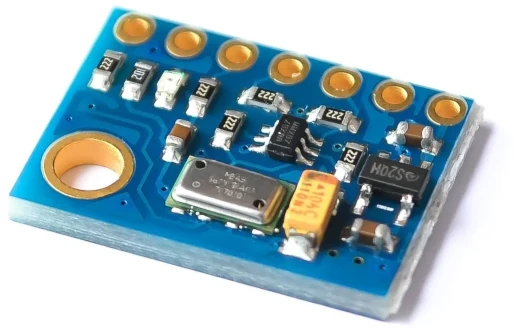

# MS5611
Arduino library for MS5611 sensor.
forked Roman Schmitz : 
* add support for tiny85 also 6780 bytes of free flash
* asynchronous mode

[datasheet](extras/ENG_DS_MS5611-01BA03_B3.pdf)

sample module :

https://fr.aliexpress.com/wholesale?SearchText=MS5611
